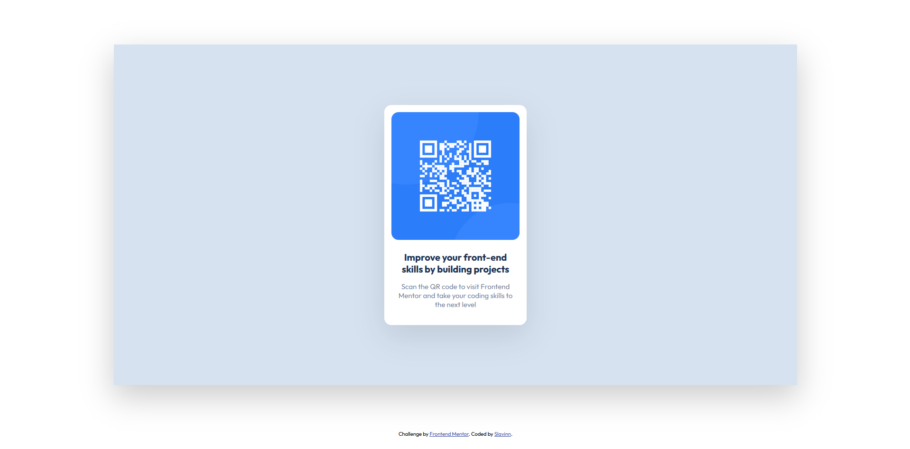

# Frontend Mentor - QR code component solution

This is a solution to the [QR code component challenge on Frontend Mentor](https://www.frontendmentor.io/challenges/qr-code-component-iux_sIO_H). Frontend Mentor challenges help you improve your coding skills by building realistic projects.

## Table of contents

- [Overview](#overview)
  - [Screenshot](#screenshot)
  - [Links](#links)
- [My process](#my-process)
  - [Built with](#built-with)
  - [What I learned](#what-i-learned)
  - [Continued development](#continued-development)
  - [Useful resources](#useful-resources)
- [Author](#author)

## Overview

### Screenshot



<!-- ### Links

- Solution URL: [Add solution URL here](https://your-solution-url.com)
- Live Site URL: [Add live site URL here](https://your-live-site-url.com) -->

## My process

Break the component down into smaller layers and build one layer at a time.

1. Blue background box - class: container-wrapper.
2. White card box - class: container.
3. Split card box into two colums using flex box.
4. Add img & content to card.
5. Style to mimic desgin

### ToDo

I still need to implement @media to account for mobile requirements.

### Built with

- Semantic HTML5 markup
- CSS custom properties
- Flexbox

### What I learned

I learned the powers of flex box and how easy it can make building html components.
The shadow around the two box layers were are to gauge, I just winged it.

### The core

```css
.container-wrapper {
  margin: 5% auto;
  display: flex;
  align-content: center;
  justify-content: center;
  background-color: hsl(212, 45%, 89%);
  width: 1440px;
  height: 720px;

  box-shadow: 0 24px 64px 2px rgba(0, 0, 0, 0.2);
}
.container {
  display: flex;
  align-self: center;
  flex-direction: column;
  background-color: hsl(0, 0%, 100%);
  width: 300px;
  height: 465px;
  row-gap: 20px;
  border-radius: 15px;

  box-shadow: 0 24px 64px 2px rgba(0, 0, 0, 0.1);
}
```

### Continued development

My knowledge of box-shadows was underwhelming, I played with numbers until it looked acceptable.

### Useful resources

- [HTML CSS COURSE](https://codingheroes.io/m) - This helped me learn HTML & CSS

## Author

- Frontend Mentor - [@Slavinn](https://www.frontendmentor.io/profile/Slavinn)
